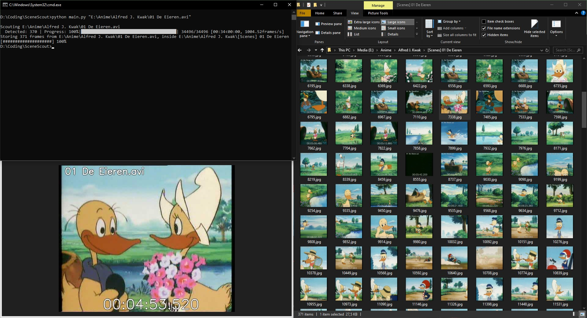
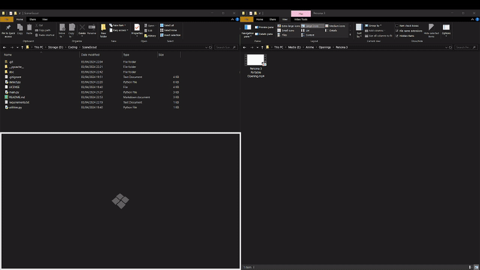

# Scene Scout
An utility Python script to generate preview pictures from video files.


## What is this?
Have you ever scrubbed through countless videos on a timeline to find a specific kind of scene you have in mind for your video edit?
This script has been created due to me wanting to automate this process a little bit. Though definitely not perfect it has the ability to go through video content and detect whenever a new scene occurs in the video with the usage of the PySceneDetect module. The script then stores these all the detected scenes as small pictures in a seperate folder, in this picture it "burns" the video title and the timecode at which the scene occurs. If all went well you're left with a folder full of images of different scenes in the video you can quickly get an overview of. When finding a scene you might be interested in you can navigate directly through the usage of the timecode burned into the picture.

## Abilities
In essence this script automates the task of detecting scenes and storing said scenes as pictures in a new folder with the timecode burned in.
The interesting part is that you can parse different input material at once
- A video file
- A path to a video
- A folder with video files (the script does not go deeper into the folders of the parsed folder, just the files in the root of the folder.)
- Or a mixture of the inputs above

  Due to this you are able to give the script lots of media to process and let it do its thing in the background while you can do something else.



## Setup
### Prerequisites
- [Python](https://www.python.org/)
- [scenedetect](https://www.scenedetect.com/) (can get it through pip)
- [opencv](https://opencv.org/) (more specifically opencv-python)

## Running
Get the latest release or directly clone the repository
```bash
git clone https://github.com/Mark-Shun/SceneScout.git
```

Navigate to your directory and install the dependencies manually or through the requirements.txt
```bash
cd SceneScout
pip install -r requirements.txt
```

## Using the script
Now you can use the script by directly drag and dropping the file(s)/folder(s) into the main.py file in your file explorer.
Or you can enter the argument(s) manually in your command shell, for example:
```bash
python main.py video.mp4 "c:/path/to/video/video.mkv" "c:/path/to/folder/with/videos"
```

## Planned features
- Additional flags to set image quality, detector used for detecting the scenes, threshold.
- Looking into detection optimization (if possible)

## Current limitations
- Folders get inspected one level deep (though perhaps you might not want it to endlessly process unintended videos deeped in the folder structure)
- The resizing of the image is not done gracefully (currently anything above 720p gets downscaled to 720p, not necesarilly respecting the original aspect ratio currently)
- Text on the pictures can misallign depending on the resolution of the input video
- Very long file names won't fit burned on the image